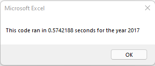
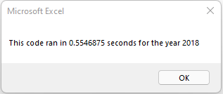
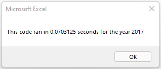
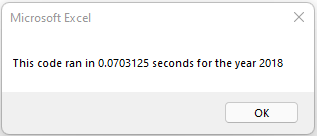

# Stock Analysis
## Project Overview
My good friend Steve needs some help analyzing green stocks for his parent's portfolio. His parents had invested in DQ and Steve wants to explore the possibility of diversifying their portofoloi with other green stocks. Steve will compare DQ's rate of return with 11 other green stocks. In short, there are 12 green stocks that needed to be analyze for the years 2017 and 2018 based on their total daily volume and rate of return. 
### Purpose
The project's purpose has two parts. First, to analyze multiple stocks using a scripted code in VBA and second, once complete, find a more efficient way of rewriting the code so as to lessen the run time. The concept of this project was to learn about loops, design patterns, and reusing codes. 
## Results
Using a nested loop, the script was able to analyze all the 12 green stocks for the specify year in a timely manner. The result run time are as follow:

| For 2017 | For 2018 |
| :---:     | :---:  |     
|   |   |

Although the code was successful and effective, there was another more efficient way of going about it. By identifying a ticker Index array and using this to be dynamic, the rest of the codes were linked to this reference. The example below shows how the ticker Index is reference from the original to the refactor code.

Thus, the new refactor code produces the same result but with a faster run time. In fact, for this instance the run time was about 8 times faster. The results are as follow:

| For 2017 (refactor) | For 2018 (refactor) |
| :---:     | :---:  |    
|   |   |

## Summary
Here, we were able to see the benefits of refactoring. The advantage of refactoring codes are to make it more efficient while still producing the same result. This is important when the amount of data points that need to be render are very large. A disadvantage to refactoring is that if a code is working, the amount of time spent rewriting and retesting it may outweight its efficiency.

When it comes to refactoring in VBA, there certainly are some pros and cons as well. For example, a positive with refactoring in VBA is that the original codes becomes more simplier for others to read or understand. A negative with refactoring in VBA is that it can be time consuming since the codes would have to be tested multiple times to get the same output. This may also include encountering and solving complex errors for an easier solution. Regardless, the more anyone works with refactoring in VBA, the more knowledge they will gain.    
